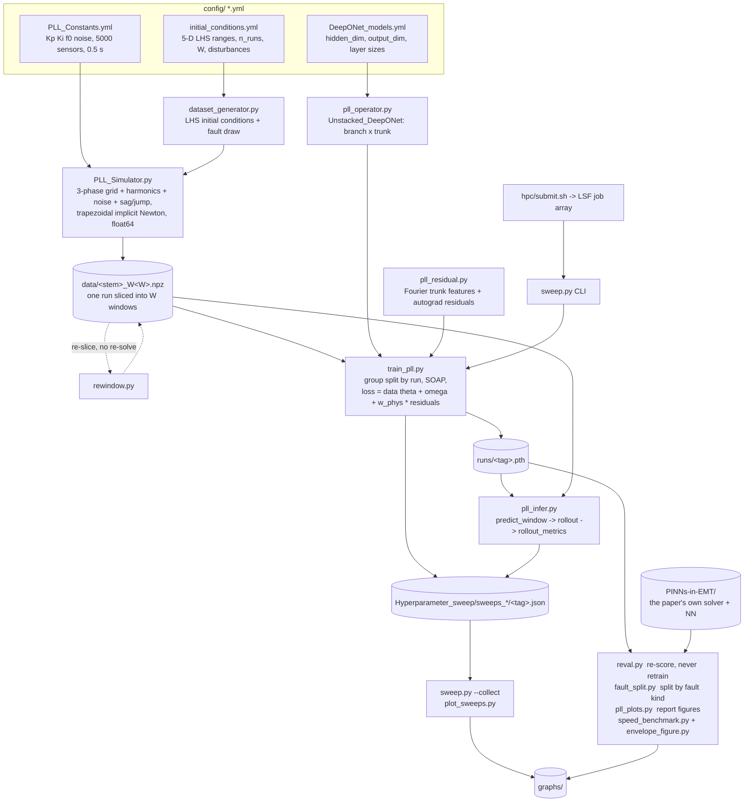

# A DeepONet surrogate for an SRF-PLL

A neural **operator** that replaces the iterative solve of a synchronous-reference-frame
phase-locked loop in an EMT simulation. Instead of stepping the PLL ODEs one timestep at
a time, the network maps

```
(theta_0, omega_0, Va, Vb, Vc over a whole window)  ->  (theta(t), omega(t)) on that window
```

and is applied **recurrently**: its own final state becomes the next window's initial
condition, so a 0.5 s trajectory is 40 handovers with no ground truth anywhere in the loop.

> **On branch `Siemens_Request` the physics is different.** The PLL limits its own
> frequency to `omega_0 +/- 2*pi*3` rad/s (47-53 Hz) — a saturation on the PI output plus
> back-calculation anti-windup, with the anti-windup gain derived as `Ki/Kp` so it stays
> correct when the gains are network inputs. Everything below describes the **unlimited**
> model and remains valid for it; the limiter's own results are `exp17` (F62-F65 in
> `docs/notes.md`). First verdict, F65: the limiter costs **2.12x even on runs where it
> never fires**, 4.05x on clean windows downstream of one that did, and 22.2x on the
> saturated windows themselves — while only 4% of windows saturate, so the aggregate
> metric shows none of it. Generate a limited family with
> `--freq_limit 18.8496`; omit it and every path is bit-identical to the unlimited one
> (verified to 8.2e-13 rad).

## Where it comes from

Two papers, one for the **system** and one for the **method**.

**The system, control gains, fault types and the benchmark come from Ventura et al.,
_Physics-Informed Neural Network Models for EMT Simulators_** (2026, under review —
Ventura, Darii, Aristidou, Bakhshizadeh, Nellikkath, Vilmann, Chatzivasileiadis). Their
code is vendored here as `PINNs-in-EMT/` and is **run directly** in the head-to-head
benchmark, not reimplemented. The deliberate departure is the surrogate's *granularity*:
they learn a **one-step map** (their eq. 8), this learns a **whole-window operator**.

**The operator architecture and training recipe come from Karampinis et al., _Neural
Operators for Power Systems: A Physics-Informed Framework for Modeling Power System
Components_** ([arXiv:2511.05216](https://arxiv.org/abs/2511.05216), PSCC 2026 submission —
Karampinis, Ellinas, Vorwerk, Chatzivasileiadis; code at
[radiakos/PowerDeepONet](https://github.com/radiakos/PowerDeepONet)). Shared with them:
the unstacked DeepONet (branch over initial conditions + sensor samples of the time-varying
input, trunk over `t`, combined by an inner product of 64 latent features), 3 tanh hidden
layers of 64, SOAP at `lr=3e-3` / `weight_decay=0.01`, LHS-sampled initial conditions, and
a physics residual added to the data loss.

The departures from Karampinis are what this project is testing:

| | Karampinis et al. | here |
|---|---|---|
| component | 4th-order synchronous machine | SRF-PLL (from Ventura et al.) |
| horizon | one trajectory over `[0,T]` in a single forward pass | `W` short windows applied **recurrently**, each fed its own predicted state |
| physics loss | separate collocation set, 1e6 points, `lambda_pd=1e-3` / `lambda_pc=1e-4` | residual on the data points, one weight `w_phys` (0.3) |
| baseline | RK45 running sequentially, `>30x` single / `6720x` at 1000 trajectories | trapezoidal implicit Newton, already **vectorised**: `53x` single, narrowing to `2.4x` at batch 512 — plus the paper NN above |

The recurrent handover is the substantive one: single-shot over `[0,T]` never tests whether
the operator's own output is a usable initial condition, and that is the whole question for
a simulator drop-in.

Current headline (n_runs=5000, W=40, F=4, max_freq=503, w_phys=0.3, 6 seeds):

| | |
|---|---|
| deployed theta RMS, 0.5 s, 40 handovers, clean runs | **3.00e-4 rad = 0.017 deg**  ([2.58, 3.20]e-4) |
| ... through voltage sags / phase jumps | 1.61x / 2.00x clean |
| vs the trapezoidal solver at the same step | **1.05-1.11x its error at 53x less compute** (batch 1; 2.4x at batch 512) |
| vs the paper's own NN, inside its trained range | **tie at half the compute**; our network alone **3.4x** more accurate |
| error growth over 40 recurrent handovers | **2.9x**, against 6.3x for an undamped random walk. Saturates |
| above the noise-driven error floor | **9.6% — and the same 9.6% at half the timestep** |

That last row is the one worth pausing on: the operator adds **no independent error floor**.
It reproduces its training solver to a constant relative accuracy at two different noise
levels. Width, window length, Fourier frequency **and the timestep** are all saturated —
halving `dt` appears to buy 1.58x, but that turned out to be the noise model shrinking with
`dt` rather than better integration, and at fixed noise spectral density the error is flat.

Robustness is measured, not assumed: grid frequency at **5x** the trained range and
amplitude at **3x** cost under 11%, and faults deeper and longer than trained degrade
gracefully. The one hard edge is the initial frequency error `omega_0`, and past ~40 rad/s
it is the **PLL loop itself** that stops acquiring inside the window, not the surrogate.

Every number, its caveat, and what would falsify it is in the **defence sheet** at the end
of `docs/notes.md`, together with the numbers that are superseded and must not be quoted.

---

## Every knob, why it is set that way, and what it costs

Each row is a decision that was measured, not assumed. `F##` are findings in
`docs/notes.md`; figures are in `graphs/`.

| knob | setting | why this value | the trade-off | evidence |
|---|---|---|---|---|
| **`output_dim`** | **2** (θ and ω as separate heads) | deriving `ω = dθ/dt − Kp·Vq` pushes raw sensor noise through `Kp` and pins ω to a floor the *formulation* creates | none found — two heads land **953×** below that floor | **F10** |
| **`w_phys`** | **0.3** | the physics term is **derivative (Sobolev) supervision**: with `Vq` read from data the residual is a supplied label for `dω/dt`. Worth **5.2×** on `val_th`, 2.34× on the operator, 1.88× deployed | it buys operator quality and **costs handover stability** — `compounding` climbs 2.83 → 6.08 as `w_phys` goes 0 → 3. The optimum is where they cross. 0.1 ties 0.3 with a worse spread | **F13, F54** · `graphs/14` |
| **`F` / `max_freq`** | **4 / 503** | what matters is **`max_freq/F` = 126 rad/s**, the *lowest* feature. Three combs sharing a lowest feature of 126 tie exactly, so the top is irrelevant | too low → degenerate with the raw `t` the trunk already has (`mf=126,F=4` starts at 31.5 rad/s = 0.06 cycles/window, the worst arm ever measured); too high → above the signal, which is 99.98% below 126 rad/s | **F31, F50, F51, F56** · `graphs/10, 20` |
| **`W`** | **40** (12.5 ms) | W=40/50/100 are statistically tied; 10 and 20 are worse | **W=20 halves the network calls** (80 → 40 per simulated second, 19.4 → 10.9 ms/sim-s) for **1.88×** the error. A real lever if speed matters | **F32, F45, F58, F60** · `graphs/11` |
| **`hidden_dim`** | **64** | `val_th` and `per_window_rms` are **flat** from 32 to 128 — the **latent** dimension is not the binding constraint | it buys **handover stability, not operator quality**: `compounding` 5.9 (h32) → 3.4 (h128). Below 64 hurts the rollout; above buys nothing. **Read F63 before generalising this**: `hidden_dim` only ever moved `sizes[-1]`, so interior width and depth were never tested — `exp17` does that | **F46, F63** · `graphs/17` |
| **`sensors`** | **5000** (dt = 100 µs) | halving `dt` *appears* to buy 1.58×, but that is the **noise model shrinking with `dt`**, not better integration. At fixed noise spectral density the error is flat | the trapezoid's own truncation error is **5 orders of magnitude** below the sensor noise — integration was never the limit. Move to 10000 to match a 50 µs EMT step, not for accuracy | **F48, F49** · `graphs/19` |
| **`n_runs`** | **5000** | 1000 → 5000 halved the train/val gap (2.60 → 1.45) and improved `val_th` 1.83× | 5000 → 10000 gives **no measurable improvement**, at 2× the data *and* 2× the epochs. The gap sits at ~1.45; that is where this setup lives, not a deficit | **F22, F55** |
| **residual form** | **eq-4** (stored `Vq`) | its null space is exactly `(θ₀, ω₀)`, so it is pure derivative supervision and **cannot** be satisfied by a wrong solution | eq-6 (`Vq` from the predicted angle) lets a *self-consistent wrong angle* zero the residual. Never better, up to **8× worse**, degrading monotonically with `w_phys` | **F16, F53** · `graphs/21` |
| **architecture** | **unstacked DeepONet** | the branch consumes the 378-sample window **once**; a plain MLP re-consumes it at all 125 query points | `Single_PINN` at matched *and* higher capacity is **~10× worse** in error terms (~107× on MSE) and **3.3× slower per epoch** — within 3% of the 3.2× predicted a priori | **F52** |
| **`omega_pll` range** | **±20 (wide)** | on a *common* test set the wide model matches the narrow one even in a ±0.2 band | narrowing buys **nothing** — the earlier 1.4× was a validation-set-difficulty artefact. Wide also covers cold acquisition, so there is no reason to ship a specialist | **F59 (retracted), F61** |
| **`Kp`, `Ki`** | **fixed** by default; **inputs** with `--gains` | as inputs, the PLL can be retuned with no retrain — something Karampinis describes as possible but does not do | **~2.5×** on angle error at 25/300 (3.5× averaged over ζ = 0.20–2.50) and **~5%** on inference time. A fixed-gain model is **38× worse** one grid step away, so this is the only option if the gains ever move | **F57, F60** · `graphs/Tunable_Kp_Ki_tests/03, 06` |
| **`split_seed`** | **0**, always | the train/val split must not move with the network init, or neither can be attributed | — | **F16** |
| **`n_eval_runs`** | **150** | at 20, subsampling noise (~11% s.e.) exceeds the effects being measured | ~5 s per checkpoint. `reval.py` re-scores without retraining | **F21** |
| optimiser | SOAP, `lr 3e-3`, `wd 0.01`, batch 512, patience 40 | inherited from Karampinis et al. and never a bottleneck | `patience` also drives the LR schedule (`patience//3`) — raising it **slows convergence**, which is what stalled the n=10000 run | **F55** |

### Tried and rejected — the other half of the table

A setting is only justified if the alternatives were measured. These were.

| tried | result | why it lost | evidence |
|---|---|---|---|
| **`ω` derived from `dθ/dt − Kp·Vq`** (one output head) | **10×** worse deployed | differentiating the network pushes raw sensor noise through `Kp`; ω is pinned to a floor the *formulation* creates, not the physics | **F10** |
| **eq-6 residual** — `Vq` recomputed from the predicted angle | never better, up to **8×** worse | breaks gauge invariance, so a *self-consistent wrong angle* zeroes the residual. Degrades monotonically with `w_phys` — the spurious minimum, exactly as predicted | **F53** · `graphs/21` |
| **Plain MLP** (`Single_PINN`), matched hyperparameters, matched *and* higher capacity | **~10×** worse (error), **3.3×** slower/epoch | re-consumes all 378 voltage samples at each of 125 query points; the operator factorisation consumes them once | **F52** |
| **`w_phys = 0`** (no physics term) | **1.88×** worse deployed, 5.2× on `val_th` | loses the free derivative labels the ODE supplies | **F54** · `graphs/14` |
| **`w_phys ≥ 1`** | up to **1.8×** worse deployed | starves the data term, which is the only thing pinning `(θ₀, ω₀)` — and the handover passes *absolute* state forward | **F54** |
| **`hidden_dim = 32`** | operator unchanged, **compounding 5.9 vs 3.4** | too narrow to keep the recurrence stable, though one-window accuracy is fine | **F46** · `graphs/17` |
| **`hidden_dim = 128`** | indistinguishable from 64 | capacity was never the constraint | **F46** |
| **`max_freq` = 100, 126, 251, 314, 754, 1006, 1257, 1885, 3770** | all worse than 503 at `F=4` | the real parameter is `max_freq/F`; these move the comb's *bottom* away from 126 rad/s | **F20, F44, F56** · `graphs/10` |
| **`F = 1`** (single frequency 503) | clearly worse | it was never one frequency — a comb is needed, and F=1 puts nothing near 126 | **F50** |
| **`W` = 10, 20** | **10.6×**, **1.88×** worse | fewer, longer windows ask more of a single forward pass. W=20 is still a *usable trade* for half the calls | **F45, F58** · `graphs/11` |
| **`W` = 50, 100** | tied with 40 | shorter windows cost more calls and buy nothing | **F32, F45** |
| **`dt = 50 µs`** (10000 sensors) | **no gain** at fixed noise PSD | the apparent 1.58× was the noise model shrinking with `dt`; trapezoid truncation is 5 orders below the sensor noise | **F49** · `graphs/19` |
| **`n_runs = 10000`** | no measurable gain, at 2× data *and* 2× epochs | data saturates near 5000; the train/val gap sits at ~1.45 either way | **F55** |
| **narrow `ω₀` range (±2)** | overlaps wide on a common test set | the earlier 1.4× advantage was a validation-set-difficulty artefact — the two splits are not equally hard | **F59 retracted, F61** |
| **`Kp`/`Ki` as inputs** | **~2.5×** worse at 25/300 | *not* rejected — it is offered as a variant. It is the only option if the gains ever move, since a fixed model is **38×** worse one grid step away | **F57, F60** · `graphs/Tunable_Kp_Ki_tests/03, 06` |

| **removing faults from training** | nothing on clean input (medians within 1.02x at W=40 on a common test set) | and it **costs 5-9x on voltage sags**, because a sag moves `Va,Vb,Vc` into amplitudes the model never saw. Phase jumps are unaffected (~1.25x for everyone) — a jump re-phases a still-clean sinusoid. Strictly worse | **F62** · `graphs/22` |
| **narrowing the `Kp`/`Ki` box** | nothing (famM ties famL everywhere on a common test) | the apparent 1.36x gain was an easier validation split. The gains-as-inputs cost is about having two extra input dimensions at all, not about how wide they are | **F62** · `graphs/22` |

### If you want something different — the levers, in order of usefulness

| you want | change | you pay | you do NOT get it from |
|---|---|---|---|
| **half the compute** | `W` 40 → 20 (25 ms windows) | 1.88× error; 19.4 → 10.9 ms/sim-s | `hidden_dim` — inference is overhead-bound, so 100× the parameters costs the same per sample (**F25**) |
| **retunable `Kp`, `Ki`** | `--gains` at generation | ~2.5× error at 25/300, ~5% inference time | anything else — a fixed-gain model is 38× worse at a nearby tuning |
| **more accuracy** | *nothing on this list.* Every knob is saturated | — | `dt` (F49), `n_runs` (F55), `hidden_dim` (F46), `W` above 40 (F45), narrower `ω₀` (F61) |
| **cold-acquisition coverage** | already have it — the wide model | nothing; it matches the narrow one in the warm regime too | — |
| **a 50 µs EMT step** | `--sensors 10000` | 2× compute, 2× data, **no accuracy change** | do it for step-matching, never for accuracy |
| **unbalanced faults** | not implemented | — | this is the largest remaining gap; negative sequence lands at 2ω = 628 rad/s in dq, which an SRF-PLL structurally cannot reject |

### Reproducing the datasets — read this before trusting a number

The `.npz` files are git-ignored (~1–4 GB each) and are not distributed. **Everything else
you need to rebuild them is here — but with one honest caveat that splits the work in
two.**

> **Families generated on or before 2026-08-20 are NOT reproducible.**
> `create_initial_condition_space` called `scipy.stats.qmc.LatinHypercube` with **no seed**,
> and `_grid_phases` drew its sensor noise from an unseeded `torch.rand`. Re-running the
> commands below gives a *statistically equivalent* family, not the same one — different
> LHS draw, different noise realisation. Every number measured on those families is
> therefore reproducible **in distribution**, not bit-for-bit. This is why
> `generate_family.py` refuses to overwrite an existing `.npz`.
>
> **Fixed 2026-08-21:** `--lhs_seed` now seeds the Latin Hypercube, the sensor noise, the
> harmonics, the fault draw and the gain draw from one stream. Verified: the same seed
> gives a **bit-identical** file across all 20 arrays; a different seed changes 17 of 20
> (the other three — `t_local`, `run_id`, `segment_id` — are deterministic by
> construction). `meta["lhs_seed"]` records it, and is `None` for the older families.
> **Always pass `--lhs_seed` from now on.**

**What agreement to expect, and what would actually be a problem.** Regenerating gives a
*different draw from the same distribution*, so the right question is not "do the digits
match" but "does it land inside the reported seed band". Every headline number here is a
band over 4-16 seeds precisely so that question can be asked:

| claim | band to land inside | seeds |
|---|---|---|
| deployed theta RMS, clean runs (famD) | [2.58, 3.20]e-4 rad | 6 |
| Fourier features vs none, `val_th` (famB) | F=0 [3.00, 4.86]e-8 vs mf503 [0.77, 1.04]e-8 | 16 each |
| `w_phys` 0 vs 0.3, `val_th` | [3.72, 5.07]e-8 vs [8.08, 9.14]e-9 | 4 each |
| W=40 vs W=20 deployed | 4.58e-4 vs 8.59e-4 | 4-6 |
| DeepONet vs plain MLP, `per_window_rms` | [8.4, 9.6]e-5 vs [8.4, 10.4]e-4 | 4 each |

A rerun that lands inside these has reproduced the work. One that lands outside is a real
disagreement worth chasing — and the seed spreads are wide enough (up to 1.6x on the
deployed metric, F24) that a single seed proves nothing either way. **Do not rerun 200
seeds**; 3-4 per arm is enough to check a band, which is why the bands are published
instead of point estimates.

**The families, and the exact command for each.** All use `config/` as committed except
where a flag overrides it.

| family | n_runs | sensors / dt | ω₀ | gains | faults | command |
|---|---|---|---|---|---|---|
| `famB_W{10,20,40,100}` | 5000 | 5000 / 100 µs | ±20 | no | **no** | `generate_family.py --stem famB --W 10 20 40 100` |
| `famD_W{40,100}` | 5000 | 5000 / 100 µs | ±20 | no | yes | `generate_family.py --stem famD --W 40 100` |
| `famE_W80` | 5000 | **10000 / 50 µs** | ±20 | no | yes | `generate_family.py --stem famE --W 80 --sensors 10000` |
| `famE_W40` | 5000 | 10000 / 50 µs | ±20 | no | yes | `rewindow.py famE_W80.npz --W 40` *(derived, bit-exact)* |
| `famG_W40` | **10000** | 10000 / 50 µs | ±20 | no | yes | `generate_family.py --stem famG --W 40 --n_runs 10000 --sensors 10000` |
| `famH_W{20,40}` | 5000 | 5000 / 100 µs | **±2** | no | yes | `generate_family.py --stem famH --W 20 40 --n_runs 5000 --omega_range 2` |
| `famI_W20` | 5000 | 5000 / 100 µs | ±20 | no | yes | `generate_family.py --stem famI --W 20 --n_runs 5000` |
| `famJ_W{20,40}` | 5000 | 5000 / 100 µs | ±20 | **yes** | yes | `generate_family.py --stem famJ --W 20 40 --n_runs 5000 --gains` |
| `famK_W{20,40}` | 5000 | 5000 / 100 µs | **±2** | **yes** | yes | `generate_family.py --stem famK --W 20 40 --n_runs 5000 --gains --omega_range 2` |
| `famL_W{20,40}` | 5000 | 5000 / 100 µs | ±20 | **yes** | **no** | `generate_family.py --stem famL --W 20 40 --n_runs 5000 --gains --no_faults --lhs_seed 11` |
| `famM_W{20,40}` | 5000 | 5000 / 100 µs | ±20 | **yes, trimmed** | **no** | `generate_family.py --stem famM --W 20 40 --n_runs 5000 --gains --no_faults --lhs_seed 11 --kp_range 18 45 --ki_range 180 520` |
| `famN_W{20,40}` | 5000 | 5000 / 100 µs | ±20 | no | yes | `generate_family.py --stem famN --W 20 40 --n_runs 5000 --lhs_seed 21 --freq_limit 18.8496` |
| `famO_W{20,40}` | 5000 | 5000 / 100 µs | ±20 | **yes** | yes | `generate_family.py --stem famO --W 20 40 --n_runs 5000 --lhs_seed 22 --freq_limit 18.8496 --gains` |
| `famP_W40` | **10000** | 5000 / 100 µs | ±20 | no | yes | `generate_family.py --stem famP --W 40 --n_runs 10000 --lhs_seed 23 --freq_limit 18.8496` |
| `famQ_W40` | **10000** | 5000 / 100 µs | ±20 | **yes** | yes | `generate_family.py --stem famQ --W 40 --n_runs 10000 --lhs_seed 24 --freq_limit 18.8496 --gains` |
| `famR_W40` | 5000 | 5000 / 100 µs | ±20 | no | yes | `generate_family.py --stem famR --W 40 --n_runs 5000 --lhs_seed 21` |
| `famS_W40` / `famT_W40` | 5000 | 5000 / 100 µs | ±20 | no | yes | as famN / famR but `--lhs_seed 25` — the second draw of the pair |

`famN`–`famT` are the **frequency-limiter** families (branch `Siemens_Request`, `exp17`);
everything above them is unlimited. Note the seeds: **famN and famR share `--lhs_seed 21`
and differ only by `--freq_limit`**, and famS/famT repeat that pair at seed 25.

**Why famR rather than famD as the unlimited control**, since the two are configured
identically otherwise: famD is a *different LHS draw*, was generated on the laptop and
never uploaded, and predates `--lhs_seed` so it can never be regenerated to match
anything. famR exists so the limiter comparison is **paired** — same initial conditions,
bit-identical `Va/Vb/Vc`, one difference.

`famB` predates the disturbance work, so it has no faults — that is why it is the
*hyperparameter* workhorse and `famD` is the deployed model. Gain ranges live under
`gains:` in `config/initial_conditions.yml` (Kp 10–50, Ki 100–600); `famM` overrides them
to Kp 18–45, Ki 180–520.

`famL` and `famM` are the **first bit-reproducible families** — everything above them was
generated before `--lhs_seed` existed. They also share `--lhs_seed 11` on purpose: with
faults off, `create_disturbance_space` returns before touching the RNG, so the two get
identical initial conditions, identical grid waveforms and identical gain *u*-draws, and
only the affine map onto `(Kp, Ki)` differs. That makes the gain-box comparison **paired**
rather than two independent draws. Reuse that seed if you regenerate either one.

**Training IS fully reproducible.** Every model's own seed, split seed and hyperparameters
are in its filename and in its JSON record, and `--split_seed 0` is fixed everywhere so
only `--seed` varies:

```
<dataset stem>_n<n_runs>_W<W>_F<F>_mf<max_freq>_wp<w_phys>_s<seed>sp<split_seed>[_h<hidden>][_pinn][_eq6][_g]
```

So `famD_W40_n5000_W40_F4_mf503_wp0.3_s1sp0.pth` is famD_W40, n=5000, W=40, F=4,
max_freq=503, w_phys=0.3, seed 1, split_seed 0 — retrain it with:

```bash
python src/sweep.py --dataset famD_W40.npz --F 4 --max_freq 503 --w_phys 0.3 --seed 1 --split_seed 0 --epochs 800 --patience 40 --n_eval_runs 150 --results_dir sweeps_famD
```

Every `hpc/exp*.txt` is the literal argument list for its array, one line per job, so any
experiment in this repo re-runs from its config file unchanged. **The one thing that will
differ is the dataset**, for the reason above — and on a machine with a different device,
because `batches()` shuffles with `torch.randperm(n, device=device)`, so CPU, MPS and CUDA
draw different minibatch orders from the same seed.

### Which figure settles which decision

| figure | decides |
|---|---|
| `01`–`06` | dataset and simulator sanity; prediction vs truth; error by window; residual budget |
| `07` | the `w_phys` sweep on the legacy n=1000 family — **superseded by `14`**, which repeats it on famB. Kept because it spans a wider `w_phys` range |
| `10` | Fourier arms — `F` and `max_freq` |
| `11` | window length `W` |
| `12` | head-to-head vs the paper's own network |
| `14` | physics weight `w_phys` |
| `15` | out-of-distribution envelope, both timesteps |
| `16` | the PLL loop's own acquisition limit — no network involved |
| `17` | width `hidden_dim` |
| `19` | does a finer timestep buy anything (solver only) |
| `20` | where the signal's power actually is — the DFT behind `max_freq` |
| `21` | eq-4 vs eq-6 residual |
| `22` | faults on/off and the gain-box width, on a common test set |
| `23` | speed against accuracy for the four deliverable models |
| `24` | what the **frequency limiter** costs, split by whether the window saturated |
| `25` | one run solved with and without the limiter — and whether the surrogate honours the band |
| `Tunable_Kp_Ki_tests/01`–`06` | the deliverable: model menu, θ/ω split, gain sensitivity, contenders, gain showcase |

### The three claims that need no caveat

1. **The operator adds no independent error floor.** It sits a constant **9.6%** above the
   noise-driven floor at two different timesteps, so its accuracy is set by the reference
   it learns from — not by anything in the network.
2. **Error growth is sub-diffusive.** **2.9×** over 40 recurrent handovers against **6.3×**
   for an undamped random walk, and it saturates. The surrogate inherits the loop's own
   damping (ζ = 0.72).
3. **The envelope was measured, not assumed.** Grid frequency at 5× and amplitude at 3×
   the trained range cost under 11%; faults deeper and longer than trained degrade
   gracefully. The one hard edge is `ω₀`, and past ~40 rad/s it is the **PLL loop itself**
   that stops acquiring inside the window — not the surrogate. (`graphs/15, 16`)

---

## How the data flows



## What each file does

### `src/` — everything importable

| file | purpose |
|---|---|
| `paths.py` | The only place that knows the layout. Resolves a bare `famB_W40.npz` to `data/`, a bare `sweeps_x` to `Hyperparameter_sweep/`. Run scripts **from the project root**. |
| `PLL_Simulator.py` | Physics. `PhysicsEquations` (Park/Clarke, the two PLL ODEs) and `PLLSimulator` (grid voltage with harmonics, sensor noise, sags, phase jumps; trapezoidal implicit integrator with a Newton solve). Run it directly for the lock-check sanity plot. |
| `dataset_generator.py` | `Dataset_Creator`: 5-D Latin-Hypercube initial conditions, per-run fault draw, one ODE solve, slice into `W` windows, save `.npz` with `meta`. `generate_multi_W` gives several `W` from **one** solve — that is what makes a W sweep vary only W. |
| `pll_operator.py` | `Unstacked_DeepONet` (branch net over ICs+voltages, trunk net over time, combined by einsum; 2 output heads) and `Single_PINN` as an architecture control. `config()` is what lets a `.pth` be rebuilt after the YAML changes. |
| `pll_residual.py` | Fourier trunk features, and `compute_theta_omega` — the forward pass plus the two ODE residuals via autograd. |
| `train_pll.py` | Training. Run-level train/val split, `omega0` standardisation, residual scaling, SOAP + plateau LR, early stopping, divergence guard, checkpoint + JSON record (which includes the deployed rollout metrics). |
| `pll_infer.py` | Deployment. `predict_window` (lean forward-only path, no autograd), `rollout` (the recurrent handover), `rollout_metrics` (deployed vs teacher-forced, and their ratio = compounding). |
| `sweep.py` | **The CLI.** One config per process; also `--collect` to table and plot a results directory. |
| `plot_sweeps.py` | Box + strip plots of a sweep directory, every seed shown as a dot. Use this over `sweep.py --plot` when there are many seeds — a min/max error bar lets one unlucky seed set the whole bar. |
| `reval.py` | Re-scores existing checkpoints at a larger `n_eval`. **Never retrain because the evaluation protocol changed.** |
| `rewindow.py` | Derives a new windowing from an existing `.npz` without re-solving, so the LHS family is preserved. **Splits and merges**; round trip verified bit-exact. |
| `fault_split.py` | Deployed metrics split by `fault_kind` (clean / sag / phase jump). A mixed number is comparable to nothing. |
| `ood_test.py` | The out-of-distribution ladder — pushes one axis at a time past the training box, with every scenario sharing one uniform draw and one noise realisation so *only* the range differs. Plots every timestep family on one absolute axis. |
| `lockin_range.py` | The SRF-PLL's own acquisition limit: cycle slips and lock time vs initial frequency error. **No network involved** — this is the reference solver alone, and it is what explains the single edge in the OOD ladder. |
| `dt_convergence.py` | Whether finer sampling buys accuracy. Solver only. Separates integration error (negligible — 5 orders below) from sensor noise, and shows the apparent `dt` gain is the noise model shrinking rather than better integration. |
| `speed_benchmark.py` | Cost and accuracy against the paper's code: their whole control block, their NN alone, their NN driven by our voltage, our solver at several steps, and us — all against one fine-grid reference. Mostly used as a **library** — `envelope_figure.py` and `ood_test.py` import `head_to_head`, `solve_at` and `deeponet_at` from it. |
| `envelope_figure.py` | `graphs/12` — the head-to-head. Two panels from one run: error against time, and accuracy against cost. Restricted to the range their released network was trained on. **Supersedes the retired figure 09**, whose right panel it duplicated and whose left panel it now draws with one more method. |
| `common_test.py` | **The** definition of a cross-family comparison: fresh trajectories at named gains, the recurrent rollout, and `load_f32`. Four scripts had grown their own copy; a per-family `val_th` is not comparable across families (F59/F61), so this must stay single-sourced. |
| `pll_plots.py` | All report figures 01-06 in one run. |

### Everything else

| path | what |
|---|---|
| `config/` | The three YAMLs above. Editing `Windows` or `sensors` changes the architecture — old checkpoints survive because `config()` is stored inside them. |
| `data/` | `*.npz` datasets, ~1-4 GB each. Nine are committed through **Git LFS**; `famG_W40` and `famF_W40` are ignored. Families made before 2026-08-21 have an unseeded LHS draw, so an overwritten one is gone and every record naming it becomes un-revaluable — hence the clobber guard. Pass `--lhs_seed` and that stops being true. |
| `runs/` | Checkpoints. Stays at the project root because every JSON record stores `"ckpt": "runs/..."`. |
| `Hyperparameter_sweep/` | One `sweeps_<family>/` directory per experiment family, one JSON per finished config. |
| `graphs/` | Numbered PNGs; `docs/notes.md` says what each one proves. |
| `hpc/` | DTU HPC job arrays. See [`hpc/README.md`](hpc/README.md). |
| `docs/notes.md` | The running log — every finding (F*), every retraction, the defence sheet. Committed. It was git-ignored until 2026-08-22, because `.gitignore` began with a bare `docs`; the workshop `.pptx`/`.xlsx` in that folder stay ignored. |
| `PINNs-in-EMT/` | The paper's own repository, used as the benchmark. Recorded as a gitlink with no `.gitmodules`, so a fresh clone gets an empty directory — see below. |

---

## Getting it running

### Install

```bash
python3 -m venv .venv && . .venv/bin/activate && pip install -r requirements.txt
```

Python >= 3.12 (`numpy==2.5.2`). Torch picks MPS / CUDA / CPU automatically.

The benchmark against the paper additionally needs their repo, which is **not** pulled by
`git clone` here (it is a gitlink without a `.gitmodules` entry):

```bash
git clone https://github.com/ignvenad/PINNs-in-EMT
```

### 1. Generate a dataset family

`config/initial_conditions.yml` sets `n_runs`, the LHS ranges and the disturbances. One
LHS draw and one ODE solve, sliced several ways:

```bash
python hpc/generate_family.py --stem famX --W 10 20 40 100 --lhs_seed 11
```

| flag | default | note |
|---|---|---|
| `--stem` | required | `famX` → `data/famX_W40.npz` |
| `--W` | `10 20 40 100` | must divide `N = sensors`; one solve, several slicings |
| `--lhs_seed` | none | **always pass it.** Seeds the LHS draw, the sensor noise, the harmonics, the fault assignment and the gain draw from one stream. Without it the family can never be regenerated |
| `--n_runs` | from YAML | overridden in memory, so the YAML is never edited under a running process |
| `--sensors` | from YAML | `time_window / sensors` **is** `dt`: 10000 over 0.5 s = 50 µs |
| `--omega_range` | 20 | half-range for the PLL's initial frequency error [rad/s] |
| `--gains` | off | sample `Kp`, `Ki` per run and store them, so the network takes them as **inputs**. Tags the model `_g` |
| `--kp_range` / `--ki_range` | from YAML | override the gain box. Either one implies `--gains` |
| `--no_faults` | off | all runs clean. `n_runs` is unchanged, so the clean regime is sampled twice as densely — but the model then never sees a sag or jump |
| `--freq_limit` | none | clamp `dtheta/dt` to `omega_0 +/-` this many **rad/s**. Siemens ask for 3 **Hz** = `18.8496`. At 3 rad/s only 78% of the LHS box locks inside 0.5 s and 50% of samples saturate; at `2*pi*3` it is 100% and 2.6% |
| `--force` | off | overwrite an existing `.npz`. Think first |

Use this rather than calling `generate_multi_W` directly — it refuses to overwrite an
existing `.npz` unless you pass `--force`. To add a **new** W to a family that already
exists, re-slice instead of regenerating (`W_new` must be a multiple of `W_old`):

```bash
python src/rewindow.py famX_W10.npz --W 50
```

### 2. Train one configuration

`sweep.py` is one config per process, so several terminals can run at once.

```bash
python src/sweep.py --dataset famX_W40.npz --F 4 --max_freq 503 --w_phys 0.3 --seed 0 --split_seed 0 --n_eval_runs 150 --results_dir sweeps_famX_ff
```

| flag | default | note |
|---|---|---|
| `--dataset` | `pll_dataset.npz` | bare name resolves to `data/` |
| `--results_dir` | `sweeps` | bare name resolves to `Hyperparameter_sweep/` |
| `--F` / `--max_freq` | from YAML | Fourier trunk features: count and top frequency [rad/s] |
| `--w_phys` | 0.0 | weight on the ODE residuals |
| `--hidden_dim` | from YAML | the **latent contraction** width, i.e. `sizes[-1]` only — *not* the interior width. F46 swept this and nothing else |
| `--n_layers` / `--width` | 2 / 64 | interior **depth** and **width**, never previously varied. Both defaults reproduce the YAML network at 45,696 params exactly |
| `--seed` | 0 | network init + minibatch order |
| `--split_seed` | 0 | train/val split — **hold this fixed, vary only `--seed`** |
| `--n_eval_runs` | 20 | **always pass 150.** 20 produced a false positive that stood for two days |
| `--epochs` `--lr` `--batch_size` `--patience` | 800, 3e-3, 512, 40 | **pass `--epochs 1200`.** W=20 hit the 800 default every single time; raising it dropped the apparent W=20 penalty from 2.3x to 1.88x, so a third of that "penalty" was the cap rather than the windowing. `patience` should be what ends a run |
| `--device` | auto | do not mix devices inside one comparison |

Writes `runs/<tag>.pth` and `Hyperparameter_sweep/<results_dir>/<tag>.json`. A run that
diverges writes a record with `status != "ok"` and no checkpoint.

**Nothing extra is needed to train on a gains dataset.** `sweep.py` detects the stored
`kp`/`ki`, normalises them on the training split, appends them to the branch input (at the
**end**, so the `Va`/`Vb`/`Vc` offsets are untouched), feeds the same per-run gains to the
physics residual, and tags the checkpoint `_g`. At inference `predict_window` then
**refuses** to run without `kp=` and `ki=` rather than silently assuming 25/300.

### 3. Collect and plot

```bash
python src/sweep.py --collect --results_dir sweeps_famX_ff --plot ff
```

```bash
python src/plot_sweeps.py sweeps_famX_ff --kind arms
```

### 4. Every figure, and the command that draws it

Each script owns its figure and regenerates it from scratch — none of them read a cached
intermediate, so a stale figure is always one command away from being correct. Run them
**from the project root**; `paths.py` resolves everything else.

| # | figure | command |
|---|---|---|
| 01-06 | initial conditions, lock check, prediction vs truth, window sweep, error by window, residual budget | `python src/pll_plots.py` |
| 10 | Fourier arms of a sweep directory (`F=0` / `mf503` / `mf628`, every seed a dot) | `python src/plot_sweeps.py sweeps_famB_ff --kind arms` |
| 11 | the `W` sweep | `python src/plot_sweeps.py sweeps_famB_W --kind W` |
| 14 | the `w_phys` sweep | `python src/plot_sweeps.py sweeps_famB_wphys --kind wphys` |
| 17 | hidden-dim sweep | `python src/plot_sweeps.py sweeps_famB_hd --kind hd` |
| 21 | eq-4 vs eq-6 | `python src/plot_sweeps.py sweeps_famB_eq4vs6 --kind residual` |
| 12 | **head-to-head**: us vs the paper's NN vs the solver — error in time and accuracy vs cost, inside their trained range | `python src/envelope_figure.py runs/<tag>.pth --n_runs 32` |
| 15 | OOD ladder — one axis at a time past the training box | `python src/ood_test.py runs/<a>.pth runs/<b>.pth --n_runs 32` |
| 16 | the loop's own acquisition limit (no network involved) | `python src/lockin_range.py` |
| 19 | does a finer timestep buy anything? (solver only) | `python src/dt_convergence.py` |
| 20 | per-window and full-run spectra — where the residual energy sits | `python src/dft_spectrum.py` |
| 22 | exp16: faults on/off and the gain box, on a common test set | `python src/exp16_report.py` |
| 23 | **speed vs accuracy** for the four deliverable models — both trades on one axis | `python src/speed_accuracy.py` |
| 24 | what the frequency limiter costs, split by whether the window saturated (**branch `Siemens_Request`**) | `python src/limiter_report.py` |
| 25 | one run solved with and without the limiter, with the clamp visible (**branch `Siemens_Request`**) | `python src/limiter_trace.py` |
| Tunable_Kp_Ki_tests/01-02 | model menu; theta and omega split | `python src/model_menu.py` |
| Tunable_Kp_Ki_tests/03 | error across the whole `(Kp, Ki)` box, gains vs fixed | `python src/gain_sensitivity.py runs/<gains tag>.pth` |
| Tunable_Kp_Ki_tests/04-06 | prediction vs truth per model (W=40, W=20), plus the gain showcase | `python src/contenders.py` |

Figure **09 is retired** — figure 12 draws its error-vs-time panel with one more method and
its cost panel was already a subset.

**Figures 12, 22 and 23 are not on a common y-axis with each other.** 12 measures error
against a 12.5 µs fine-grid reference inside the paper NN's trained range; 22 and 23
measure against the 100 µs training solver at `ω₀ ∈ ±2`. Same-looking axes, different
definitions of "θ RMS". Anything comparing two *families* must go through
`common_test.py`, never through a per-family `val_th` — that confusion is F59, retracted
in F61, and it has cost this project five separate results.

### Not figures

| command | what you get |
|---|---|
| `python src/PLL_Simulator.py` | Simulator sanity check: settled `Vd -> +1`, `Vq -> 0`, and the lock plot |
| `python src/reval.py sweeps_famX_ff --n_eval 150` | Re-score every checkpoint in a directory. Rewrites the JSONs in place — back the directory up first |
| `python src/fault_split.py runs/<tag>.pth` | Deployed metrics split into clean / sag / phase jump |
| `python src/rewindow.py famX_W10.npz --W 50` | Derive a new windowing without re-solving. Splits and merges; round trip verified bit-exact |
| `python src/speed_benchmark.py` | Cost tables against the paper's own solver and NN. Also the library behind figures 12 and 15 |
| `python hpc/smoke_test.py` | One real optimiser step; checks the environment can train, not just import |
| `python hpc/bench.py` | Optimiser-step cost on this machine, every W, every thread count |

### 5. On the cluster

Full instructions in [`hpc/README.md`](hpc/README.md). In short:

```bash
sh hpc/setup_env.sh
sh hpc/submit.sh hpc/exp1_w40_fourier.txt ffw40
```

`submit.sh` strips comments, prints the numbered job list and bakes the config path into
the jobscript (LSF does not forward the submitting shell's environment). `hpc/pending.py`
prints the config lines with no record yet, so a resubmit redoes only what was lost.

---

## House rules that experiments here obey

1. **`--n_eval_runs 150`, always.** Subsampling noise at 20 is larger than the effects
   being measured.
2. **Fix `--split_seed 0`; vary only `--seed`.** Otherwise the train/val split moves with
   the network init and neither can be attributed.
3. **`reval.py` re-scores; it does not retrain.** A change to the evaluation protocol is
   never a reason to spend GPU-hours again.
4. **One LHS family per comparison.** Datasets are unseeded, so a regenerated file is a
   different experiment wearing the same filename.
5. **One device per comparison.** `batches()` shuffles with `torch.randperm(n, device=...)`,
   so CPU, MPS and CUDA draw different minibatch orders from the same seed.
6. **Report a band, not a point.** `rollout_full_rms` keeps a ~1.6x spread across seeds
   even at `n_runs=5000`; `val_th` and `per_window_rms` are the low-variance metrics that
   actually detect a difference.
