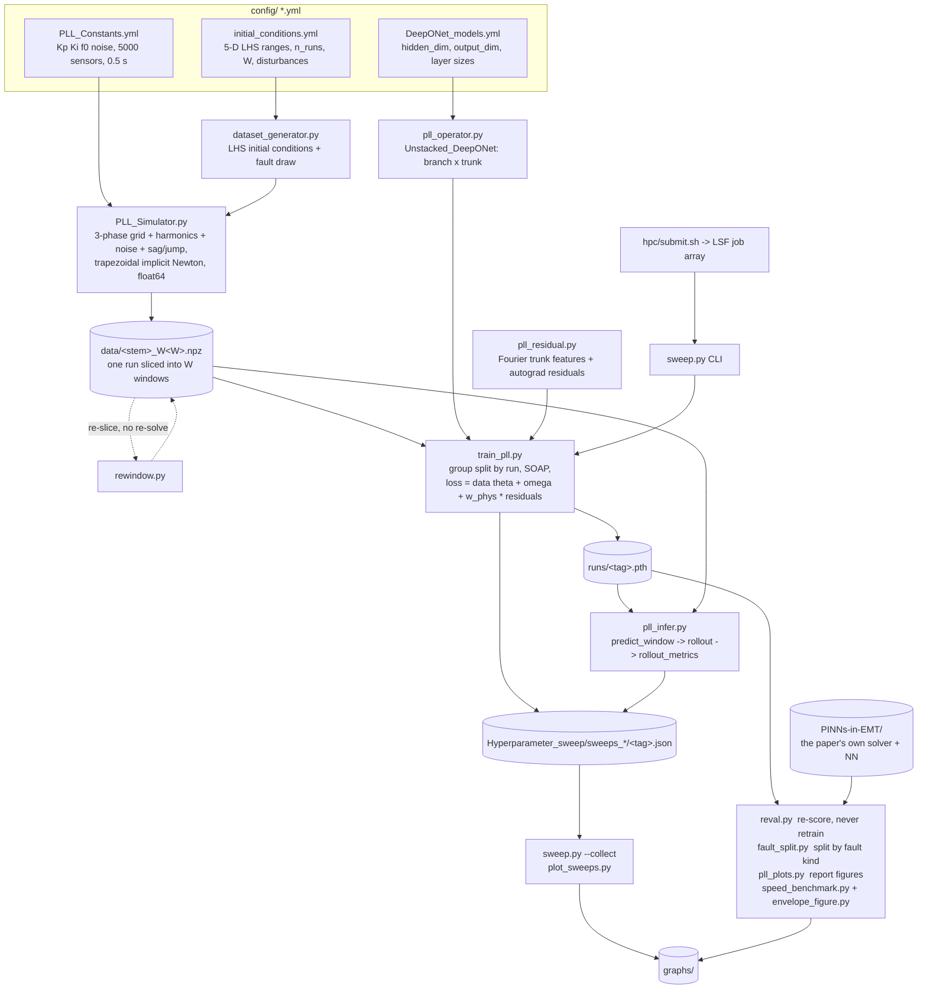

# A DeepONet surrogate for an SRF-PLL

A neural **operator** that replaces the iterative solve of a synchronous-reference-frame
phase-locked loop in an EMT simulation. Instead of stepping the PLL ODEs one timestep at
a time, the network maps

```
(theta_0, omega_0, Va, Vb, Vc over a whole window)  ->  (theta(t), omega(t)) on that window
```

and is applied **recurrently**: its own final state becomes the next window's initial
condition, so a 0.5 s trajectory is 40 handovers with no ground truth anywhere in the loop.

## Where it comes from

Two papers, one for the **system** and one for the **method**.

**The system, control gains, fault types and the benchmark come from Ventura et al.,
_Physics-Informed Neural Network Models for EMT Simulators_** (2026, under review —
Ventura, Darii, Aristidou, Bakhshizadeh, Nellikkath, Vilmann, Chatzivasileiadis). Their
code is vendored here as `PINNs-in-EMT/` and is **run directly** in the head-to-head
benchmark, not reimplemented. The deliberate departure is the surrogate's *granularity*:
they learn a **one-step map** (their eq. 8), this learns a **whole-window operator**.

**The operator architecture and training recipe come from Karampinis et al., _Neural
Operators for Power Systems: A Physics-Informed Framework for Modeling Power System
Components_** ([arXiv:2511.05216](https://arxiv.org/abs/2511.05216), PSCC 2026 submission —
Karampinis, Ellinas, Vorwerk, Chatzivasileiadis; code at
[radiakos/PowerDeepONet](https://github.com/radiakos/PowerDeepONet)). Shared with them:
the unstacked DeepONet (branch over initial conditions + sensor samples of the time-varying
input, trunk over `t`, combined by an inner product of 64 latent features), 3 tanh hidden
layers of 64, SOAP at `lr=3e-3` / `weight_decay=0.01`, LHS-sampled initial conditions, and
a physics residual added to the data loss.

The departures from Karampinis are what this project is testing:

| | Karampinis et al. | here |
|---|---|---|
| component | 4th-order synchronous machine | SRF-PLL (from Ventura et al.) |
| horizon | one trajectory over `[0,T]` in a single forward pass | `W` short windows applied **recurrently**, each fed its own predicted state |
| physics loss | separate collocation set, 1e6 points, `lambda_pd=1e-3` / `lambda_pc=1e-4` | residual on the data points, one weight `w_phys` (0.3) |
| baseline | RK45 running sequentially, `>30x` single / `6720x` at 1000 trajectories | trapezoidal implicit Newton, already **vectorised**: `53x` single, narrowing to `2.4x` at batch 512 — plus the paper NN above |

The recurrent handover is the substantive one: single-shot over `[0,T]` never tests whether
the operator's own output is a usable initial condition, and that is the whole question for
a simulator drop-in.

Current headline (n_runs=5000, W=40, F=4, max_freq=503, w_phys=0.3, 6 seeds):

| | |
|---|---|
| deployed theta RMS, 0.5 s, 40 handovers, clean runs | **3.00e-4 rad = 0.017 deg**  ([2.58, 3.20]e-4) |
| ... through voltage sags / phase jumps | 1.61x / 2.00x clean |
| vs the trapezoidal solver at the same step | **1.05-1.11x its error at 53x less compute** (batch 1; 2.4x at batch 512) |
| vs the paper's own NN, inside its trained range | **tie at half the compute**; our network alone **3.4x** more accurate |
| error growth over 40 recurrent handovers | **2.9x**, against 6.3x for an undamped random walk. Saturates |
| above the noise-driven error floor | **9.6% — and the same 9.6% at half the timestep** |

That last row is the one worth pausing on: the operator adds **no independent error floor**.
It reproduces its training solver to a constant relative accuracy at two different noise
levels. Width, window length, Fourier frequency **and the timestep** are all saturated —
halving `dt` appears to buy 1.58x, but that turned out to be the noise model shrinking with
`dt` rather than better integration, and at fixed noise spectral density the error is flat.

Robustness is measured, not assumed: grid frequency at **5x** the trained range and
amplitude at **3x** cost under 11%, and faults deeper and longer than trained degrade
gracefully. The one hard edge is the initial frequency error `omega_0`, and past ~40 rad/s
it is the **PLL loop itself** that stops acquiring inside the window, not the surrogate.

Every number, its caveat, and what would falsify it is in the **defence sheet** at the end
of `docs/notes.md`, together with the numbers that are superseded and must not be quoted.

---

## How the data flows



## What each file does

### `src/` — everything importable

| file | purpose |
|---|---|
| `paths.py` | The only place that knows the layout. Resolves a bare `famB_W40.npz` to `data/`, a bare `sweeps_x` to `Hyperparameter_sweep/`. Run scripts **from the project root**. |
| `PLL_Simulator.py` | Physics. `PhysicsEquations` (Park/Clarke, the two PLL ODEs) and `PLLSimulator` (grid voltage with harmonics, sensor noise, sags, phase jumps; trapezoidal implicit integrator with a Newton solve). Run it directly for the lock-check sanity plot. |
| `dataset_generator.py` | `Dataset_Creator`: 5-D Latin-Hypercube initial conditions, per-run fault draw, one ODE solve, slice into `W` windows, save `.npz` with `meta`. `generate_multi_W` gives several `W` from **one** solve — that is what makes a W sweep vary only W. |
| `pll_operator.py` | `Unstacked_DeepONet` (branch net over ICs+voltages, trunk net over time, combined by einsum; 2 output heads) and `Single_PINN` as an architecture control. `config()` is what lets a `.pth` be rebuilt after the YAML changes. |
| `pll_residual.py` | Fourier trunk features, and `compute_theta_omega` — the forward pass plus the two ODE residuals via autograd. |
| `train_pll.py` | Training. Run-level train/val split, `omega0` standardisation, residual scaling, SOAP + plateau LR, early stopping, divergence guard, checkpoint + JSON record (which includes the deployed rollout metrics). |
| `pll_infer.py` | Deployment. `predict_window` (lean forward-only path, no autograd), `rollout` (the recurrent handover), `rollout_metrics` (deployed vs teacher-forced, and their ratio = compounding). |
| `sweep.py` | **The CLI.** One config per process; also `--collect` to table and plot a results directory. |
| `plot_sweeps.py` | Box + strip plots of a sweep directory, every seed shown as a dot. Use this over `sweep.py --plot` when there are many seeds — a min/max error bar lets one unlucky seed set the whole bar. |
| `reval.py` | Re-scores existing checkpoints at a larger `n_eval`. **Never retrain because the evaluation protocol changed.** |
| `rewindow.py` | Derives a new windowing from an existing `.npz` without re-solving, so the LHS family is preserved. **Splits and merges**; round trip verified bit-exact. |
| `fault_split.py` | Deployed metrics split by `fault_kind` (clean / sag / phase jump). A mixed number is comparable to nothing. |
| `ood_test.py` | The out-of-distribution ladder — pushes one axis at a time past the training box, with every scenario sharing one uniform draw and one noise realisation so *only* the range differs. Plots every timestep family on one absolute axis. |
| `lockin_range.py` | The SRF-PLL's own acquisition limit: cycle slips and lock time vs initial frequency error. **No network involved** — this is the reference solver alone, and it is what explains the single edge in the OOD ladder. |
| `dt_convergence.py` | Whether finer sampling buys accuracy. Solver only. Separates integration error (negligible — 5 orders below) from sensor noise, and shows the apparent `dt` gain is the noise model shrinking rather than better integration. |
| `speed_benchmark.py` | Cost and accuracy against the paper's code: their whole control block, their NN alone, their NN driven by our voltage, our solver at several steps, and us — all against one fine-grid reference. |
| `envelope_figure.py` | The single accuracy-vs-cost figure (`graphs/12_head_to_head.png`), restricted to the range their released network was trained on. |
| `pll_plots.py` | All report figures 01-06 in one run. |

### Everything else

| path | what |
|---|---|
| `config/` | The three YAMLs above. Editing `Windows` or `sensors` changes the architecture — old checkpoints survive because `config()` is stored inside them. |
| `data/` | `*.npz` datasets. **Git-ignored** (~1 GB each) and **unreproducible** — the LHS draw is unseeded, so an overwritten dataset is gone and every record naming it becomes un-revaluable. |
| `runs/` | Checkpoints. Stays at the project root because every JSON record stores `"ckpt": "runs/..."`. |
| `Hyperparameter_sweep/` | One `sweeps_<family>/` directory per experiment family, one JSON per finished config. |
| `graphs/` | Numbered PNGs; `docs/notes.md` says what each one proves. |
| `hpc/` | DTU HPC job arrays. See [`hpc/README.md`](hpc/README.md). |
| `docs/notes.md` | The running log — every finding (F*), every retraction, the roadmap. **Git-ignored**, so it lives only on the laptop. |
| `PINNs-in-EMT/` | The paper's own repository, used as the benchmark. Recorded as a gitlink with no `.gitmodules`, so a fresh clone gets an empty directory — see below. |

---

## Getting it running

### Install

```bash
python3 -m venv .venv && . .venv/bin/activate && pip install -r requirements.txt
```

Python >= 3.12 (`numpy==2.5.2`). Torch picks MPS / CUDA / CPU automatically.

The benchmark against the paper additionally needs their repo, which is **not** pulled by
`git clone` here (it is a gitlink without a `.gitmodules` entry):

```bash
git clone https://github.com/ignvenad/PINNs-in-EMT
```

### 1. Generate a dataset family

`config/initial_conditions.yml` sets `n_runs`, the LHS ranges and the disturbances. One
LHS draw and one ODE solve, sliced several ways:

```bash
python hpc/generate_family.py --stem famX --W 10 20 40 100
```

Use this rather than calling `generate_multi_W` directly — it refuses to overwrite an
existing `.npz` unless you pass `--force`. To add a **new** W to a family that already
exists, re-slice instead of regenerating (`W_new` must be a multiple of `W_old`):

```bash
python src/rewindow.py famX_W10.npz --W 50
```

### 2. Train one configuration

`sweep.py` is one config per process, so several terminals can run at once.

```bash
python src/sweep.py --dataset famX_W40.npz --F 4 --max_freq 503 --w_phys 0.3 --seed 0 --split_seed 0 --n_eval_runs 150 --results_dir sweeps_famX_ff
```

| flag | default | note |
|---|---|---|
| `--dataset` | `pll_dataset.npz` | bare name resolves to `data/` |
| `--results_dir` | `sweeps` | bare name resolves to `Hyperparameter_sweep/` |
| `--F` / `--max_freq` | from YAML | Fourier trunk features: count and top frequency [rad/s] |
| `--w_phys` | 0.0 | weight on the ODE residuals |
| `--hidden_dim` | from YAML | |
| `--seed` | 0 | network init + minibatch order |
| `--split_seed` | 0 | train/val split — **hold this fixed, vary only `--seed`** |
| `--n_eval_runs` | 20 | **always pass 150.** 20 produced a false positive that stood for two days |
| `--epochs` `--lr` `--batch_size` `--patience` | 800, 3e-3, 512, 40 | |
| `--device` | auto | do not mix devices inside one comparison |

Writes `runs/<tag>.pth` and `Hyperparameter_sweep/<results_dir>/<tag>.json`. A run that
diverges writes a record with `status != "ok"` and no checkpoint.

### 3. Collect and plot

```bash
python src/sweep.py --collect --results_dir sweeps_famX_ff --plot ff
```

```bash
python src/plot_sweeps.py sweeps_famX_ff --kind arms
```

### 4. Everything else you can run

| command | what you get |
|---|---|
| `python src/PLL_Simulator.py` | Simulator sanity check: settled `Vd -> +1`, `Vq -> 0`, and the lock plot |
| `python src/pll_plots.py` | Report figures 01-06 into `graphs/` |
| `python src/reval.py sweeps_famX_ff --n_eval 150` | Re-score every checkpoint in a directory. Rewrites the JSONs in place — back the directory up first |
| `python src/fault_split.py runs/<tag>.pth` | Deployed metrics split into clean / sag / phase jump |
| `python src/speed_benchmark.py` | Cost table vs the paper's solvers, plus `graphs/09_accuracy_vs_step.png` |
| `python src/envelope_figure.py runs/<tag>.pth --n_runs 32` | `graphs/12_head_to_head.png` — the head-to-head |
| `python src/ood_test.py runs/<a>.pth runs/<b>.pth --n_runs 32` | `graphs/15_ood_ladder.png`. Pass checkpoints from different families to compare timesteps on one axis; `W`/`S`/`dt` are read from each checkpoint, so the datasets need not be present |
| `python src/lockin_range.py` | `graphs/16_lockin_range.png` — the loop's acquisition limit |
| `python src/dt_convergence.py` | `graphs/19_dt_convergence.png` — does a finer timestep buy anything? |
| `python hpc/smoke_test.py` | One real optimiser step; checks the environment can train, not just import |
| `python hpc/bench.py` | Optimiser-step cost on this machine, every W, every thread count |

### 5. On the cluster

Full instructions in [`hpc/README.md`](hpc/README.md). In short:

```bash
sh hpc/setup_env.sh
sh hpc/submit.sh hpc/exp1_w40_fourier.txt ffw40
```

`submit.sh` strips comments, prints the numbered job list and bakes the config path into
the jobscript (LSF does not forward the submitting shell's environment). `hpc/pending.py`
prints the config lines with no record yet, so a resubmit redoes only what was lost.

---

## House rules that experiments here obey

1. **`--n_eval_runs 150`, always.** Subsampling noise at 20 is larger than the effects
   being measured.
2. **Fix `--split_seed 0`; vary only `--seed`.** Otherwise the train/val split moves with
   the network init and neither can be attributed.
3. **`reval.py` re-scores; it does not retrain.** A change to the evaluation protocol is
   never a reason to spend GPU-hours again.
4. **One LHS family per comparison.** Datasets are unseeded, so a regenerated file is a
   different experiment wearing the same filename.
5. **One device per comparison.** `batches()` shuffles with `torch.randperm(n, device=...)`,
   so CPU, MPS and CUDA draw different minibatch orders from the same seed.
6. **Report a band, not a point.** `rollout_full_rms` keeps a ~1.6x spread across seeds
   even at `n_runs=5000`; `val_th` and `per_window_rms` are the low-variance metrics that
   actually detect a difference.
